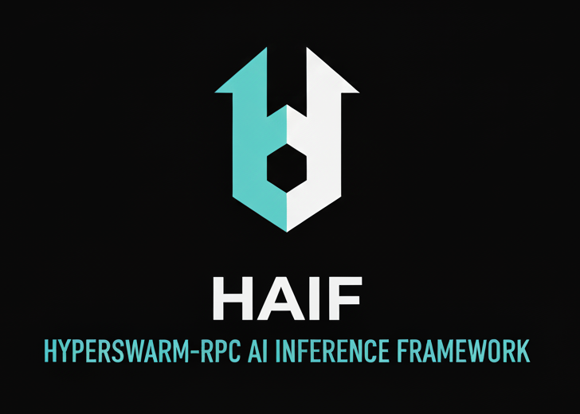

# Hyperswarm-RPC AI Inference Framework ("HAIF") 

Production-ready microservices framework for AI inference over RPC. It provides a Gateway for client requests, an Orchestrator that schedules work, a Registry for model metadata, Workers that run inference, and a full observability stack (Prometheus, Grafana, Loki, Jaeger) — all wired together with Docker Compose.

## Table of Contents
- Overview
- Architecture
- Quick Start
- Configuration
- Observability
- Example Apps
- Deployment
- Troubleshooting
- Documentation
- License

## Overview
- Purpose: handle AI inference requests end-to-end with a modular, scalable stack.
- Core services:
  - HTTP Bridge (`http://localhost:8080`): public HTTP API that translates to RPC.
  - RPC Gateway: validates, rate-limits, and forwards requests over Hyperswarm RPC.
  - Orchestrator: schedules and dispatches jobs to Workers over RPC.
  - Registry: model and metadata management via RPC.
  - Worker: executes inference locally (CPU/GPU), announces presence/capabilities.
- Observability:
  - Prometheus (`http://localhost:9090`) metrics.
  - Grafana (`http://localhost:3001`) dashboards.
  - Loki (`http://localhost:3100`) logs (via Promtail).
  - Jaeger (`http://localhost:16686`) distributed traces.

## Architecture
- Request flow:
  - Clients send inference requests to the **HTTP Bridge** (`POST /infer`).
  - The bridge forwards to the **RPC Gateway**, which validates and submits to the **Orchestrator**.
  - The **Orchestrator** selects a **Worker** and performs inference via **@hyperswarm/rpc**.
  - Workers stream results back through the Orchestrator → Gateway → Bridge to clients.
- Data & state:
  - Postgres (`5432`) stores orchestration state and registry metadata.
  - Redis (`6379`) provides lightweight coordination/queues.
- Instrumentation:
  - OpenTelemetry SDK in all Node services emits metrics (Prometheus) and traces (OTLP → Jaeger via the collector).

See the C4 docs for deeper design details under `docs/` (links at the bottom).

## Quick Start
Prerequisites:
- Docker and Docker Compose v2 installed.

Start everything:
- From repo root, run: `docker compose up -d`
- This builds images and starts services with health checks and restart policies.

Service URLs:
- HTTP Bridge: `http://localhost:8080`
- Web Chat: `http://localhost:5173`
- Prometheus: `http://localhost:9090`
- Grafana: `http://localhost:3001`
- Jaeger UI: `http://localhost:16686`
- Loki API: `http://localhost:3100`
- PlantUML server (for docs): `http://localhost:8085`

Stop and clean:
- Stop: `docker compose down`
- Stop and remove volumes: `docker compose down -v` (removes Postgres/Redis data)

## Configuration
The stack is configured via environment variables in `docker-compose.yml`. You can set overrides with a `.env` file in the repo root or by exporting variables before running Compose.

Key variables:
- `POSTGRES_USER`, `POSTGRES_PASSWORD`, `POSTGRES_DB`: database credentials (defaults: `haif`, `haifpass`, `haif`).
- `MODEL_ID`: default model for Worker (default: `Xenova/TinyLlama-1.1B-Chat-v1.0`).
- `OTEL_PROMETHEUS_PORT`, `OTEL_PROMETHEUS_ENDPOINT`: metrics export port and path (defaults: `9464`, `/metrics`).
- `OTEL_EXPORTER_OTLP_TRACES_ENDPOINT`: OTLP traces endpoint (Orchestrator uses `http://otel-collector:4318/v1/traces`).
- `GATEWAY_URL` (Web Chat): internal URL for the Gateway when running inside Compose (`http://gateway:3000`). If running Web Chat locally, use `http://localhost:3000`.

Examples:
- Override model: create `.env` with `MODEL_ID=TheBloke/Llama-2-7B-GGUF` and run `docker compose up -d`.
- Scale workers: `docker compose up -d --scale worker=3`.

## Observability
The observability stack is provisioned for immediate use:

- Metrics (Prometheus):
  - Node services export metrics on `:9464`.
  - Prometheus scrapes: `gateway:9464`, `orchestrator:9464`, `registry:9464`, `worker:9464`.
  - Open Prometheus at `http://localhost:9090` to query metrics.

- Logs (Loki + Promtail):
  - Promtail tails Docker container logs and ships to Loki at `http://localhost:3100`.
  - In Grafana, use Explore → select `Loki` and filter by `service` label (e.g., `service="gateway"`).

- Traces (OTEL → Jaeger):
  - Orchestrator exports via the collector (`otel-collector` on `4318`), others default to Jaeger directly.
  - View traces in Jaeger UI at `http://localhost:16686`.

- Dashboards (Grafana):
  - URL: `http://localhost:3001` (default credentials: `admin`/`admin`).
  - Pre-provisioned datasources: Prometheus, Loki, Jaeger.
- Prebuilt dashboards under folder `HAIF`:
    - Service Overview: throughput, error rate, latency (P95).
    - Worker Inference: request rate, failures, inference duration (P95).

- Alerts:
  - Prometheus rules under `observability/alerts.yml` (error rate and latency thresholds).
  - Alertmanager at `http://localhost:9093` (webhook placeholder — replace with your endpoint in `observability/alertmanager.yml`).

## Example Apps
- Web Chat (Vite):
  - Run with Compose: `docker compose up -d web-chat` → open `http://localhost:5173`.
  - Run locally:
    - `npm --prefix examples/web-chat install`
    - `npm --prefix examples/web-chat run dev`
    - Open `http://localhost:5173`.
  - Configure Gateway URL in the UI if different (default `http://localhost:3000`).

- CLI:
  - Install: `npm --prefix examples/cli install`
  - Run simple input: `npm --prefix examples/cli run infer -- "Hello world"`
  - Run JSON payload: `GATEWAY_URL=http://localhost:8080 npm --prefix examples/cli run infer -- '{"input":"Hello"}'`

## Deployment
Production deployment recommendations:
- Use Compose or convert to your orchestrator (Kubernetes, Nomad) with equivalent resources and networking.
- Harden secrets: set strong `POSTGRES_*` credentials and remove defaults in production.
- Network/TLS:
  - Place the Gateway behind a reverse proxy (e.g., Nginx, Traefik) with TLS.
  - Restrict internal service ports to the private network only.
- Scaling:
  - Scale `worker` replicas based on throughput (`docker compose up -d --scale worker=N`).
  - Monitor CPU/memory/latency in Grafana to right-size.
- Persistence:
  - Map volumes to durable storage for Postgres and Loki (`pgdata`, `lokidata`).
- Health & rollout:
  - All services include health checks; use them for zero-downtime deployments.

## Troubleshooting
- Services unhealthy:
  - View logs: `docker compose logs -f gateway orchestrator registry worker`.
  - Verify dependent services (Postgres/Redis) are healthy.
- Grafana dashboards empty:
  - Check Prometheus at `http://localhost:9090` for targets and queries.
  - Confirm metrics exporters are reachable on `:9464`.
- No traces:
  - Ensure `otel-collector` and `jaeger` are up; check Orchestrator env `OTEL_EXPORTER_OTLP_TRACES_ENDPOINT`.
- Web Chat cannot reach Gateway:
  - Confirm Gateway is on `http://localhost:3000`; update the UI field if needed.

## Documentation
- Architecture Overview: [docs/README-architecture.md](docs/README-architecture.md)
- SLOs: [docs/slo-table.md](docs/slo-table.md)
- Threat Model: [docs/threat-model.md](docs/threat-model.md)

The C4 Model is a simple, hierarchical way to document and communicate software architecture. It breaks the system into 4 views at increasing levels of detail:
- C4-1 Context: [docs/c4-context.md](docs/c4-context.md) — the system in its environment, users and external systems.
- C4-2 Containers: [docs/c4-containers.md](docs/c4-containers.md) — deployable/runtime units (services, databases), responsibilities and interactions.
- C4-3 Components: [docs/c4-components.md](docs/c4-components.md) — major internal building blocks within each container and how they collaborate.
- C4-4 Code: [docs/c4-code.md](docs/c4-code.md) — code-level structure for key components where useful.

Diagrams are authored in Markdown and PlantUML. A PlantUML server is included in the stack at `http://localhost:8085` to render UML when needed.

## License
Licensed under the MIT License. See `LICENSE` for details.
