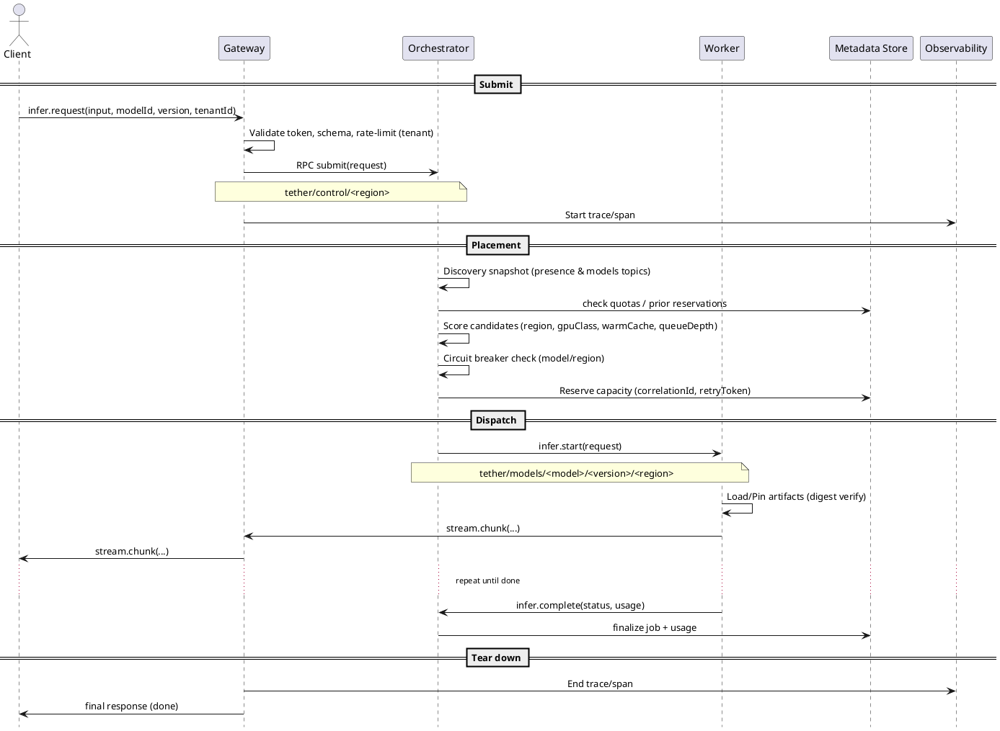

# Tether – C4 Architecture (Phase 1)

> Author: Alvaro Paco • Date: 2025-10-03 • Notation: **PlantUML + C4-PlantUML**

This document delivers the **Context** and **Container** C4 diagrams and a focused write‑up on **service discovery over Hyperswarm**. Next iteration will add Component diagrams (Orchestrator, Worker) and a lightweight Code/Deployment view.

---

## 1) C4 – Context Diagram

```plantuml
@startuml Context-Tether
!include https://raw.githubusercontent.com/plantuml-stdlib/C4-PlantUML/master/C4_Context.puml

LAYOUT_WITH_LEGEND()
SHOW_LEGEND(true)

skinparam shadowing false
skinparam rectangle {
  roundCorner 12
}

' People
Person(client, "API Client / SDK", "Product teams integrating inference APIs")
Person(devops, "Tether Operator", "Runs/observes the platform; manages rollouts and quotas")

' System under design
System_Boundary(tether, "Tether – AI Inference Network") {
  System(tethplat, "Tether Platform", "P2P orchestration + model execution at the edge/workers")
}

' External systems
System_Ext(artifact, "Model Artifact Store", "Object storage (e.g., S3/Hypercore)")
System_Ext(observ, "Observability Stack", "OTel traces, metrics TSDB, logs")
System_Ext(billing, "Billing/IAM Provider", "Tenants, authN/Z, usage reporting")

Rel(client, tethplat, "Submit inference request / stream result", "RPC via Gateway (Hyperswarm topic)")
Rel(devops, tethplat, "Operate, configure, rollout", "CLI/UI over RPC topics")
Rel(tethplat, artifact, "Pull model weights/adapters", "Content-addressed, signed")
Rel(tethplat, observ, "Export traces/metrics/logs", "OTel exporters / remote-write")
Rel(tethplat, billing, "Usage & quota checks", "Async usage export / token validation")

SHOW_LEGEND()
@enduml
```

### Notes

* **Transport**: Core inter-service communication runs over **Hyperswarm RPC topics** (no central HTTP mesh for the critical path).
* **Execution**: **Workers** (edge nodes) load models locally and execute inference; the **Orchestrator** matches requests to healthy workers.

---

## 2) C4 – Container Diagram

```plantuml
@startuml Container-Tether
!includeurl https://raw.githubusercontent.com/plantuml-stdlib/C4-PlantUML/master/C4_Container.puml

LAYOUT_WITH_LEGEND()
SHOW_LEGEND(true)
skinparam shadowing false
skinparam roundcorner 12

Person(client, "API Client / SDK")
Person(devops, "Tether Operator")

System_Boundary(tether, "Tether – AI Inference Network") {
  Container(gateway, "RPC Gateway", "Node.js / Go", "Edge adapter: validates, normalizes, rate-limits, emits trace context")
  Container(orch, "Orchestrator/Scheduler", "Go / Rust", "Discovers workers, matches requests, retries, circuit-breakers")
  Container(reg, "Model Registry", "Service", "Catalog of models, versions, capabilities, policies")
  ContainerDb(meta, "Metadata Store", "Postgres/SQLite-cluster", "Jobs, quotas, tokens, indexes; strongly-consistent")
  ContainerQueue(dlq, "Error Queue / DLQ", "Queue", "Failed jobs, poison messages for analysis")
  Container(obsagent, "Observability Exporters", "Sidecar/Daemon", "OTel traces, metrics, logs")

  Boundary(region, "Worker Fleet (by Region)") {
    Container(worker, "Inference Worker", "BaseWorker + ModelRuntime", "Runs models locally (CPU/GPU), exposes infer()")
  }
}

System_Ext(artifact, "Model Artifact Store", "S3/Hypercore", "Content-addressed, signed")
System_Ext(observ, "Observability Stack", "Prometheus/Tempo/Loki or equivalents")
System_Ext(billing, "Billing/IAM Provider", "Tenant auth, quotas, usage export")

' Client paths
Rel(client, gateway, "Submit inference, stream result", "Hyperswarm RPC")
Rel(gateway, orch, "Route request, attach policy/tenant", "Hyperswarm RPC")
Rel(orch, worker, "Dispatch job; reserve capacity; stream chunks", "Hyperswarm RPC topics")

' Control/data paths
Rel(orch, reg, "Query model capabilities/policies", "RPC")
Rel(reg, meta, "Read/write model metadata", "SQL")
Rel(orch, meta, "Jobs, tokens, quotas, reservations", "SQL")
Rel(worker, artifact, "Fetch model weights/adapters (digest)", "HTTPS/P2P")
Rel(obsagent, observ, "Export traces/metrics/logs", "OTel / remote-write")
Rel(orch, dlq, "Push failed jobs/poison msgs", "Enqueue")
Rel(gateway, billing, "Validate token / report usage (async)", "HTTP/RPC")
Rel(orch, billing, "Periodic usage export", "Batch")

SHOW_LEGEND()
@enduml
```

### Key Contracts & Topics (for labels in diagrams/readme)

* **Topics**

  * Presence: `tether/presence/<region>`
  * Models: `tether/models/<model>/<version>/<region>`
  * Control: `tether/control/<region>`
* **RPC Contracts** (high level)

  * `Infer.Request { tenantId, modelId, version, input, correlationId, retryToken, traceId }`
  * `Infer.Chunk { correlationId, seq, payload, done }`
  * `Health.Report { workerId, capacity, gpuClass, modelCache }`

---

## 3) Service Discovery over Hyperswarm (design write‑up)

**Goals**: zero single‑point‑of‑failure, fast worker discovery, and resilient routing under churn.

### 3.1 Announce & Discover

* **Workers** announce presence on `tether/presence/<region>` with:

  * `workerId`, `pubKey`, `gpuClass`, `capacity`, `supported {modelId, version}`, `latencyHops`.
  * Signed heartbeat every *T=5s*; expiry window *3×T*.
* **Model availability**: Workers also subscribe/announce on model‑specific topics `tether/models/<model>/<version>/<region>` to simplify targeted discovery.
* **Orchestrator** maintains an **eventually‑consistent view** of fleet health from topic messages; **strong decisions** (quotas, reservations) are written to **Metadata Store**.

### 3.2 Scheduling & Backpressure

* **Affinity score** per request: `(model match) + (region proximity) + (gpuClass match) + (queueDepth inverse) + (warmCache bonus)`.
* **Backpressure**: token‑bucket at **Gateway** (per tenant) + **queue depth thresholds** at workers → if exceeded, **shed** or **degrade** (return lower‑latency model/params when policy allows).
* **Retries**: exponential backoff with **retryToken** (idempotency) and **circuit‑breaker** trips per model/region.

### 3.3 Security

* Node **keypairs**; presence and model announcements are **signed** and **nonce‑protected** to mitigate replay.
* Transport encryption via Hyperswarm’s crypto; optional end‑to‑end payload encryption per tenant policy.

### 3.4 Model Artifacts

* **Content‑addressed** (digest) with signatures; **N≥3** replicas.
* Workers **verify signatures** before load; support **warm pools** & **on‑the‑fly adapter merges** (e.g., LoRA) with cache eviction by LRU + size budget.

### 3.5 Observability & SLOs

* **Trace every request** (correlationId, traceId) via Gateway → Orchestrator → Worker.
* SLIs: P50/P95 latency by model, success rate, throttle rate, stale‑cache rate.
* **Error budgets** gate rollouts (progressive canary on workers via control topic).

---

## 4) Next (in Phase 1 – Components & Deployment)

* **Component (Orchestrator)**: DiscoverySub, Scheduler, Policy Engine, Circuit Breaker, Retry Manager; sequence for request lifecycle.
* **Component (Worker)**: BaseWorker, ModelLoader, ExecutionEngine, HealthReporter, QuotaGuard; sequence from receive→stream→finalize.
* **Lightweight Code/Deployment view**: class sketch of BaseWorker inheritance; topology by region/replicas.

> ✅ When you’re ready, tell me the preferred **model/topic naming** and any constraints from Theter’s infra so I can tune the diagrams and move to Component views.

---

## 5) Decision Package — Topic Naming & Infra Constraints (Final)

### 5.1 Topic Namespace (agreed)

Using a **hierarchical** layout, all lowercase, slash‑separated, hyphenated tokens, no spaces:

* Presence (per region): `tether/presence/<region>`
* Model availability (per model+version+region): `tether/models/<model>/<version>/<region>`
* Control plane (per region): `tether/control/<region>`
* Optional job streams (per request): `tether/jobs/<correlationId>` (ephemeral, GC by TTL)

**Examples**

* `tether/presence/eu-west`
* `tether/models/llama3.1-8b/1.0/us-east`
* `tether/control/sa-east`

**Conventions**

* `<model>`: kebab‑case (e.g., `mixtral-8x7b`), `<version>`: semver (`MAJOR.MINOR`), `<region>`: cloud‑style slugs (e.g., `us-east`, `eu-west`, `sa-east`).
* All announcements **signed** by node keypair; heartbeats every **5s**, expiry **15s**.

### 5.2 Infra Assumptions & Constraints (initial)

* **Network/Discovery**: Public DHT via Hyperswarm with **private bootstrap** nodes allowed; workers can run behind NAT if outbound is open.
* **Security**: Node keypairs (Curve/Noise), signed presence/messages; tenant API tokens validated at **Gateway**; optional E2E payload encryption per tenant.
* **Regions**: Multi‑region **from day one**; region is **mandatory** in all topics.
* **Artifacts**: Primary store **S3‑compatible** (minio ok); content‑addressed with signature + SHA‑256 digest; N≥3 replicas; workers verify before load.
* **Workers**: Heterogeneous (CPU/GPU); capability labels include `gpuClass`, `vramGB`, `accelerators`.
* **Observability**: OTel everywhere; metrics remote‑write to a centralized TSDB; logs to a Loki‑like store; traces to Tempo/Jaeger‑compatible backend.
* **Quotas/Policy**: Quotas and rate limits checked at Gateway + Orchestrator; policy engine reads from Metadata Store.

> These decisions are reflected below in the Component diagrams and will guide the deployment view.

---

## 6) C4 – Component Diagram: Orchestrator/Scheduler

```plantuml
@startuml Component-Orchestrator
!include https://raw.githubusercontent.com/plantuml-stdlib/C4-PlantUML/master/C4_Component.puml

LAYOUT_WITH_LEGEND()
SHOW_LEGEND(true)

Container_Boundary(orch, "Orchestrator/Scheduler") {
  Component(discSub, "DiscoverySub", "Subscriber", "Consumes presence/model topics; maintains fleet snapshot")
  Component(scheduler, "Scheduler", "Service", "Affinity scoring, capacity check, placement")
  Component(policy, "Policy Engine", "Library", "Quota, rate limit, model routing policies")
  Component(cb, "Circuit Breaker", "Library", "Trip/open per model/region based on errors/latency")
  Component(retry, "Retry Manager", "Library", "Idempotent retries with retryToken & backoff")
  Component(resv, "Reservation Manager", "Service", "Reserves capacity; writes job state to Metadata Store")
}

Container_Ext(gateway, "RPC Gateway", "Edge Adapter")
Container_Ext(worker, "Inference Worker", "ModelRuntime")
ContainerDb_Ext(meta, "Metadata Store", "Postgres/SQLite-cluster")
ContainerQueue_Ext(dlq, "Error Queue / DLQ", "Queue")

Rel(gateway, scheduler, "Dispatch request", "RPC over Hyperswarm")
Rel(discSub, scheduler, "Fleet snapshot (in‑memory cache)")
Rel(scheduler, policy, "Evaluate policy/quotas")
Rel(scheduler, cb, "Check breaker state")
Rel(scheduler, retry, "Plan retries/backoff")
Rel(scheduler, resv, "Reserve capacity; persist job", "SQL")
Rel(resv, meta, "Write job + reservation", "SQL")
Rel(scheduler, worker, "Assign job / stream chunks", "RPC topics")
Rel(scheduler, dlq, "Poison/failed jobs → enqueue")

SHOW_LEGEND()
@enduml
```

**Notes**

* `DiscoverySub` subscribes to `tether/presence/<region>` and `tether/models/<model>/<version>/<region>`.
* `Scheduler` ranks candidates using: region proximity, gpuClass, warmCache, queueDepth, breaker state, tenant policy.
* `Reservation Manager` ensures idempotency via `(correlationId, retryToken)` and persists state before dispatch.

---

## 7) C4 – Component Diagram: Inference Worker

```plantuml
@startuml Component-Worker
!include https://raw.githubusercontent.com/plantuml-stdlib/C4-PlantUML/master/C4_Component.puml

LAYOUT_WITH_LEGEND()
SHOW_LEGEND(true)

Container_Boundary(worker, "Inference Worker") {
  Component(base, "BaseWorker", "Lib/Runtime", "Common RPC server, health reporting, auth hooks")
  Component(loader, "ModelLoader", "Module", "Fetch/verify artifacts; warm cache; manage adapters (LoRA)")
  Component(exec, "ExecutionEngine", "Module", "Run model on CPU/GPU; stream tokens/chunks")
  Component(health, "HealthReporter", "Module", "Heartbeats, capacity, cache manifest → presence topic")
  Component(quota, "QuotaGuard", "Module", "Per‑tenant limits; local backpressure")
}

Container_Ext(orch, "Orchestrator/Scheduler")
Container_Ext(artifact, "Model Artifact Store", "S3/Hypercore")

Rel(orch, base, "infer() RPC", "Hyperswarm topic")
Rel(loader, artifact, "Fetch by digest; verify sig", "HTTPS/P2P")
Rel(health, orch, "Announce on presence + model topics")
Rel(exec, base, "Stream chunks → Gateway via Orchestrator")
Rel(quota, base, "Check local tokens / shed if needed")

SHOW_LEGEND()
@enduml
```

**Notes**

* `HealthReporter` publishes every **5s**; worker expires after **15s** silence.
* `ModelLoader` pins hot models; eviction policy **LRU + VRAM budget**; adapters can be merged on load.
* `ExecutionEngine` supports **graceful stop** on shutdown; in‑flight jobs finalize or reroute.

---

## 8) Lightweight Deployment View

```plantuml
@startuml Deployment-Tether
!include https://raw.githubusercontent.com/plantuml-stdlib/C4-PlantUML/master/C4_Deployment.puml

Deployment_Node(cloud, "Cloud Regions") {
  Deployment_Node(useast, "us-east") {
    Container(gateway1, "Gateway")
    Container(orch1, "Orchestrator")
    ContainerDb(meta1, "Metadata Store")
    Node(workerA, "Worker A (gpuClass=a100, vramGB=80)")
    Node(workerB, "Worker B (gpuClass=rtx4090, vramGB=24)")
  }
  Deployment_Node(euwest, "eu-west") {
    Container(gateway2, "Gateway")
    Container(orch2, "Orchestrator")
    ContainerDb(meta2, "Metadata Store (replica)")
    Node(workerC, "Worker C (cpu-only)")
  }
}

Rel(gateway1, orch1, "RPC topics")
Rel(orch1, workerA, "jobs")
Rel(orch1, workerB, "jobs")
Rel(orch2, workerC, "jobs")
Rel(meta1, meta2, "replication")
@enduml
```

**Assumptions**

* Gateways and Orchestrators are deployed **per region**; Metadata Store uses **regional primary + cross‑region replica**.
* Workers are elastic; adding a worker only requires it to announce on the correct topics with valid keys.

---

## 9) Phase 1 — Acceptance Checklist & Review Plan

### 9.1 Acceptance checklist
- [x] C4 Context diagram
- [x] C4 Container diagram
- [x] Component diagram — Orchestrator/Scheduler
- [x] Component diagram — Inference Worker
- [x] Lightweight Deployment view
- [x] Request Lifecycle sequence
- [x] Decision Package (topic naming + infra constraints)
- [x] ADRs 001–005 (transport, topics, retries/breakers, artifacts, observability)
- [ ] README “Architecture at a Glance” linking all diagrams (see §12)
- [ ] PNG/SVG exports of all diagrams (see §12)
- [ ] Security threat model (STRIDE quick pass) (see §12)
- [ ] SLO table (P50/P95 per model tier) (see §12)

### 9.2 Review plan
**Stakeholders:** Platform Architect, SRE/DevOps, Security, Product.

**Agenda (60 min):**
1. (15m) Walkthrough: Context → Container → Components → Deployment → Sequence  
2. (15m) Risks & trade-offs: discovery churn, backpressure, artifact integrity, multi-region failover  
3. (15m) Security & compliance: keys, signed announcements, IAM integration, audit trail  
4. (15m) Open decisions & next steps

**Open questions to close in review:**
- Public DHT only or private bootstrap-nodes-only peering?
- Allow Gateway↔Worker direct streaming for hot paths?
- Billing/IAM provider interface (token format, usage export cadence)?
- Artifact store SLA/limits (object size, regional replication policy)?
- Target SLOs by tier (latency/availability per model class)?

**Approval criteria:** Sign-off from Arch + Security + SRE; no P1 risks unowned; §12 items scheduled.

## 10) Request Lifecycle – Sequence



**Notes**

* `retryToken` ensures idempotency if Gateway must resend; Orchestrator uses reservation to avoid duplicate work.
* Streaming is **Gateway↔Worker via Orchestrator** (can be optimized to direct Gateway↔Worker path if policy allows).

---

## 11) Architecture Decision Records (ADRs)

> Format: *Status • Context • Decision • Consequences*

### ADR‑001 — Inter‑service Transport via Hyperswarm RPC

**Status**: Accepted
**Context**: Need decentralized discovery, NAT‑friendly comms, and low SPOF risk.
**Decision**: Use Hyperswarm DHT + topics for service discovery and RPC; secure with node keypairs and signed announcements.
**Consequences**: Removes central mesh dependency; requires careful churn handling, signed heartbeats, and ops tooling for topic health.

### ADR‑002 — Topic Taxonomy & Naming

**Status**: Accepted
**Context**: Predictable, multi‑region, multi‑model routing with future extensibility.
**Decision**: Hierarchical, lowercase topics:

* `tether/presence/<region>`
* `tether/models/<model>/<version>/<region>`
* `tether/control/<region>`
  **Consequences**: Clear debugging and partitioning; migrations simpler; topic explosion mitigated via pruning & TTL.

### ADR‑003 — Idempotency, Retries & Circuit Breakers

**Status**: Accepted
**Context**: P2P churn and partial failures require robust client experience.
**Decision**: Correlate via `(correlationId, retryToken)`; exponential backoff; per model/region circuit breakers; reservations persisted before dispatch.
**Consequences**: Higher success rates under failure; requires Metadata Store consistency and breaker telemetry.

### ADR‑004 — Artifact Strategy (Content‑addressed, Signed)

**Status**: Accepted
**Context**: Workers run local models; artifacts must be verifiable and cacheable.
**Decision**: Store artifacts in S3‑compatible storage using digest (SHA‑256) and signatures; workers verify prior to load; maintain warm caches.
**Consequences**: Integrity and reproducibility guaranteed; adds signature management and cache eviction logic.

### ADR‑005 — Observability Baseline (OTel‑first)

**Status**: Accepted
**Context**: Distributed P2P + streaming requires end‑to‑end visibility.
**Decision**: OpenTelemetry for traces/metrics/logs; remote‑write metrics; structured logs; per‑request and per‑model SLIs with dashboards and error budgets.
**Consequences**: Consistent telemetry across services; needs sampling/retention policies to control cost.

---

## 12) Wrap‑up & Next Deliverables

* Add **README – Architecture at a Glance** with links to all diagrams.
* Generate **PNG/SVG** exports for each PlantUML block.
* Draft **security threat model** (STRIDE quick pass) and **SLO table** (P50/P95 targets per model tier).
