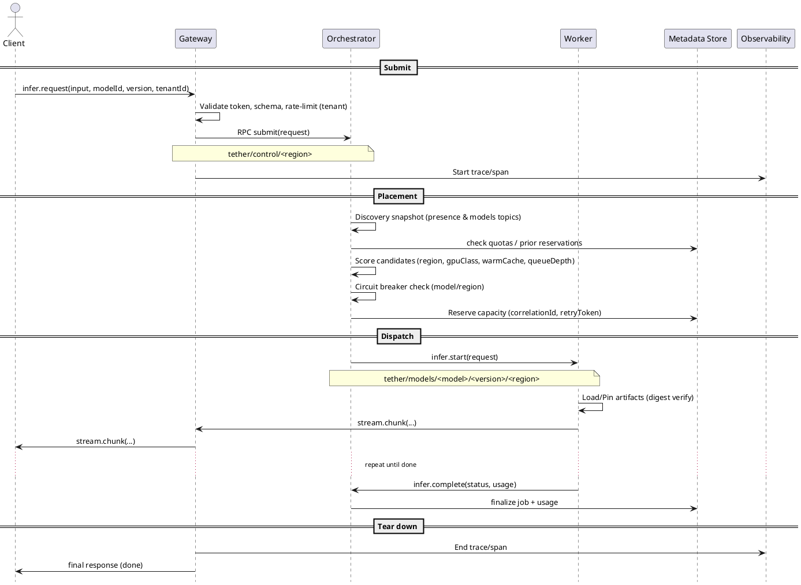

# Tether – C4 Model — Code

Related layers: [Context](./c4-context.md) • [Containers](./c4-containers.md) • [Components](./c4-components.md)

## 8) Lightweight Deployment View

```plantuml
@startuml Deployment-Tether
!include https://raw.githubusercontent.com/plantuml-stdlib/C4-PlantUML/master/C4_Deployment.puml

Deployment_Node(cloud, "Cloud Regions") {
  Deployment_Node(useast, "us-east") {
    Container(gateway1, "Gateway")
    Container(orch1, "Orchestrator")
    ContainerDb(meta1, "Metadata Store")
    Node(workerA, "Worker A (gpuClass=a100, vramGB=80)")
    Node(workerB, "Worker B (gpuClass=rtx4090, vramGB=24)")
  }
  Deployment_Node(euwest, "eu-west") {
    Container(gateway2, "Gateway")
    Container(orch2, "Orchestrator")
    ContainerDb(meta2, "Metadata Store (replica)")
    Node(workerC, "Worker C (cpu-only)")
  }
}

Rel(gateway1, orch1, "RPC topics")
Rel(orch1, workerA, "jobs")
Rel(orch1, workerB, "jobs")
Rel(orch2, workerC, "jobs")
Rel(meta1, meta2, "replication")
@enduml
```

**Assumptions**

* Gateways and Orchestrators are deployed **per region**; Metadata Store uses **regional primary + cross‑region replica**.
* Workers are elastic; adding a worker only requires it to announce on the correct topics with valid keys.

---

## 10) Request Lifecycle – Sequence



**Notes**

* `retryToken` ensures idempotency if Gateway must resend; Orchestrator uses reservation to avoid duplicate work.
* Streaming is **Gateway↔Worker via Orchestrator** (can be optimized to direct Gateway↔Worker path if policy allows).