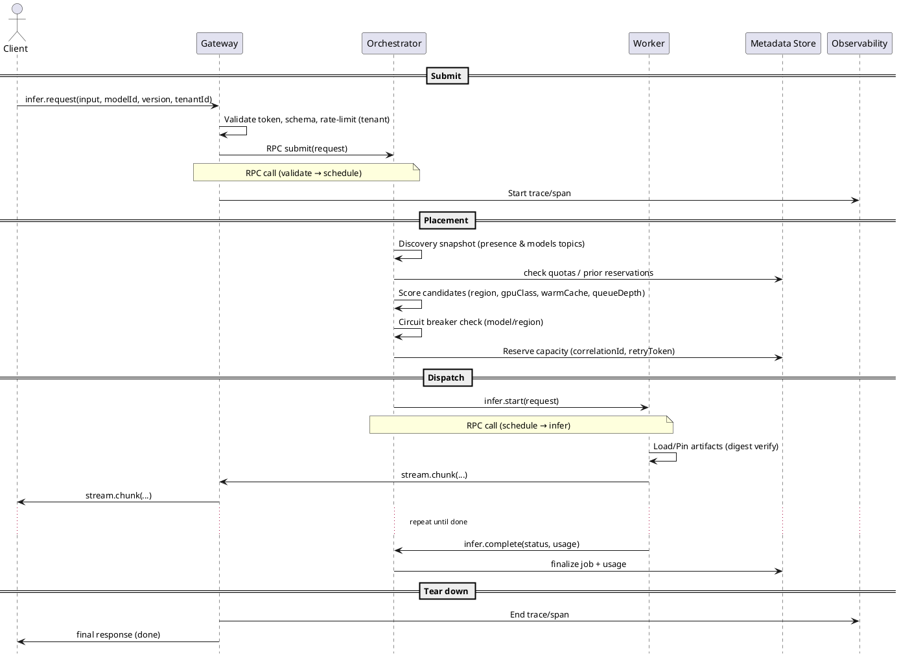
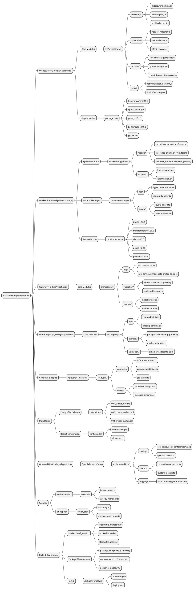

# HAIF – C4 Model — Code

Related layers: [Context](./c4-context.md) • [Containers](./c4-containers.md) • [Components](./c4-components.md)

## 8) Lightweight Deployment View

```plantuml
@startuml Deployment-HAIF
!include https://raw.githubusercontent.com/plantuml-stdlib/C4-PlantUML/master/C4_Deployment.puml

Deployment_Node(cloud, "Cloud Regions") {
  Deployment_Node(useast, "us-east") {
    Container(gateway1, "Gateway")
    Container(orch1, "Orchestrator")
    ContainerDb(meta1, "Metadata Store")
    Node(workerA, "Worker A (gpuClass=a100, vramGB=80)")
    Node(workerB, "Worker B (gpuClass=rtx4090, vramGB=24)")
    Node(otel1, "OTel Collector")
    Node(prom1, "Prometheus")
    Node(loki1, "Loki")
    Node(graf1, "Grafana")
    Node(alert1, "Alertmanager")
  }
  Deployment_Node(euwest, "eu-west") {
    Container(gateway2, "Gateway")
    Container(orch2, "Orchestrator")
    ContainerDb(meta2, "Metadata Store (replica)")
    Node(workerC, "Worker C (cpu-only)")
    Node(otel2, "OTel Collector")
    Node(prom2, "Prometheus")
    Node(loki2, "Loki")
    Node(graf2, "Grafana")
    Node(alert2, "Alertmanager")
  }
}

Rel(gateway1, orch1, "RPC (@hyperswarm/rpc)")
Rel(orch1, workerA, "jobs")
Rel(orch1, workerB, "jobs")
Rel(orch2, workerC, "jobs")
Rel(meta1, meta2, "replication")
Rel(gateway1, otel1, "OTLP traces/metrics/logs")
Rel(orch1, otel1, "OTLP traces/metrics/logs")
Rel(workerA, otel1, "OTLP traces/metrics/logs")
Rel(workerB, otel1, "OTLP traces/metrics/logs")
Rel(otel1, prom1, "metrics")
Rel(otel1, loki1, "logs")
Rel(prom1, graf1, "dashboards")
Rel(loki1, graf1, "dashboards")
Rel(prom1, alert1, "alerts")
Rel(gateway2, otel2, "OTLP traces/metrics/logs")
Rel(orch2, otel2, "OTLP traces/metrics/logs")
Rel(workerC, otel2, "OTLP traces/metrics/logs")
Rel(otel2, prom2, "metrics")
Rel(otel2, loki2, "logs")
Rel(prom2, graf2, "dashboards")
Rel(loki2, graf2, "dashboards")
Rel(prom2, alert2, "alerts")
@enduml
```

**Assumptions**

* Gateways and Orchestrators are deployed **per region**; Metadata Store uses **regional primary + cross‑region replica**.
* Workers are elastic; adding a worker only requires it to announce on the correct topics with valid keys.

---

## 10) Request Lifecycle – Sequence



**Notes**

* `retryToken` ensures idempotency if Gateway must resend; Orchestrator uses reservation to avoid duplicate work.
* Streaming is **Gateway↔Worker via Orchestrator** (can be optimized to direct Gateway↔Worker path if policy allows).

---

### Summary

**Service Discovery & Communication**
- Sequence shows Gateway validating and forwarding requests over Hyperswarm RPC. Orchestrator uses discovery snapshots from presence/model topics to place the request, then streams results back; observability spans wrap the lifecycle.

**Data Storage & Replication**
- Reservations and finalization write to the regional Metadata Store; cross‑region replication supports DR. Artifacts are verified and loaded at the Worker with local warm caches.

**Scalability & Robustness**
- Circuit breakers and retries protect the system from cascading failures; sharding by model/tenant/region enables targeted scaling. DLQ collects poison messages.

**Local AI Execution**
- The Worker runs the model locally and streams results; GPU/CPU selection aligns with `gpuClass` and capacity.

---

## 11) Code Implementation Mindmap



Render the mindmap with PlantUML to visualize the code-level structure and relationships.

---

## 12) Package Configuration Examples

#### Orchestrator package.json
```json
{
  "name": "@haif/orchestrator",
  "version": "1.0.0",
  "type": "module",
  "scripts": {
    "start": "node dist/index.js",
    "dev": "tsx watch src/index.ts",
    "build": "tsc",
    "test": "vitest"
  },
  "dependencies": {
    "hyperswarm": "^2.15.3",
    "opossum": "^6.3.0",
    "p-retry": "^5.1.2",
    "bottleneck": "^2.19.5",
    "pg": "^8.8.0",
    "ioredis": "^5.3.2",
    "@opentelemetry/api": "^1.4.1",
    "@opentelemetry/auto-instrumentations-node": "^0.39.4",
    "winston": "^3.10.0",
    "joi": "^17.9.2"
  },
  "devDependencies": {
    "typescript": "^5.1.6",
    "tsx": "^3.12.7",
    "vitest": "^0.34.1",
    "@types/node": "^20.4.5"
  }
}
```

#### Worker requirements.txt
```txt
# ML Core Dependencies
torch>=2.0.0,<3.0.0
transformers>=4.30.0,<5.0.0
vllm>=0.2.0,<1.0.0
accelerate>=0.21.0

# System Monitoring
psutil>=5.9.0
pynvml>=11.5.0
GPUtil>=1.4.0

# Data Processing
numpy>=1.24.0
pandas>=2.0.0
pillow>=10.0.0

# Networking & RPC
aiohttp>=3.8.0
websockets>=11.0.0
msgpack>=1.0.0

# Observability
opentelemetry-api>=1.18.0
opentelemetry-sdk>=1.18.0
prometheus-client>=0.17.0

# Development
pytest>=7.4.0
black>=23.7.0
mypy>=1.5.0
```

#### Gateway package.json
```json
{
  "name": "@haif/gateway",
  "version": "1.0.0",
  "type": "module",
  "scripts": {
    "start": "node dist/server.js",
    "dev": "tsx watch src/server.ts",
    "build": "tsc"
  },
  "dependencies": {
    "fastify": "^4.21.0",
    "node-rate-limiter-flexible": "^2.4.2",
    "zod": "^3.22.2",
    "jsonwebtoken": "^9.0.2",
    "@fastify/cors": "^8.3.0",
    "@fastify/helmet": "^11.1.1",
    "hyperswarm": "^2.15.3"
  }
}
```

```
